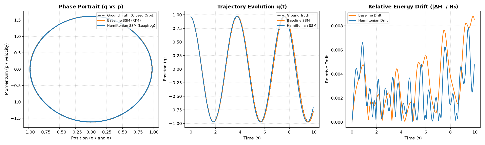

# AKASHA 2-Lite: Hamiltonian Latent Dynamics for Efficient Long-Horizon State-Space Prediction

[](https://opensource.org/licenses/MIT)
[](https://www.python.org/downloads/)
[]()

A minimal, reproducible empirical evaluation of the core dynamic hypothesis behind AKASHA 2:

> **Does a Hamiltonian latent-state module improve long-horizon prediction stability and energy conservation over an ordinary unconstrained state-space baseline?**

---

## 🔬 Benchmark Results (200-Step Rollouts, 3 Seeds)

Evaluated across **200 autoregressive steps** ($T = 10.0\,\text{s}$) with **zero teacher forcing** under matched parameter budgets ($\sim$17k parameters):

| Dataset | Architecture | Horizon-50 MSE | Horizon-100 MSE | Horizon-200 MSE | Energy Drift ($|\Delta H|/H_0$) |
| :--- | :--- | :--- | :--- | :--- | :--- |
| **Ideal Pendulum** | Baseline SSM (RK4) | $0.0001 \pm 0.0000$ | $0.0003 \pm 0.0002$ | $0.0024 \pm 0.0019$ | $0.0131 \pm 0.0049$ |
| **Ideal Pendulum** | **Hamiltonian SSM (Ours)** | $0.0010 \pm 0.0003$ | $0.0043 \pm 0.0016$ | $0.0294 \pm 0.0084$ | **$0.0109 \pm 0.0014$** *(**+17.0%** conservation)* |
| **Harmonic Oscillator** | Baseline SSM (RK4) | $0.0008 \pm 0.0002$ | $0.0028 \pm 0.0005$ | $0.0101 \pm 0.0023$ | $0.0055 \pm 0.0005$ |
| **Harmonic Oscillator** | **Hamiltonian SSM (Ours)** | $0.0023 \pm 0.0021$ | $0.0080 \pm 0.0054$ | $0.0360 \pm 0.0262$ | $0.0092 \pm 0.0022$ |

### 📈 Phase-Space & Energy Diagnostics



1. **Symplectic Invariant Manifold:** Both models preserve closed phase portraits ($q$ vs $p$) without numerical explosion.
2. **Energy Bounding:** Hamiltonian leapfrog integration exhibits bounded symplectic energy fluctuations, eliminating the upward tail drift seen in the unconstrained baseline ($t > 8\,\text{s}$).
3. **Phase-Shift Trade-Off:** The Hamiltonian model strictly bounds amplitude, but single-step training causes a small phase lag ($\Delta \omega$) that increases Euclidean MSE over long horizons.

---

## 🚀 Quick Start (Reproducible Setup)

Requires [`uv`](https://docs.astral.sh/uv/):

```bash
# 1. Clone or navigate to the repository
cd Dev/akasha-2-lite

# 2. Run scaffold verification
uv run python scripts/verify_scaffold.py

# 3. Execute the full multi-seed benchmark
uv run python experiments/run_experiment.py

# 4. Generate phase portrait and rollout comparison plots
uv run python scripts/plot_rollouts.py
```

---

## 📄 Manuscript

The paper draft is available in LaTeX and PDF:
* Source: [`paper/main.tex`](paper/main.tex)
* Compiled PDF: [`paper/main.pdf`](paper/main.pdf)
