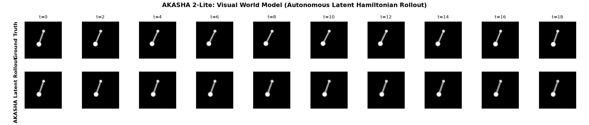

# AKASHA 2-Lite: Hamiltonian Latent Dynamics for Efficient Long-Horizon State-Space Prediction

[](https://opensource.org/licenses/MIT)
[](https://www.python.org/downloads/)
[]()

A minimal, reproducible empirical evaluation of the core dynamic hypothesis behind AKASHA 2:

> **Does a Hamiltonian latent-state module improve long-horizon prediction stability and energy conservation over an ordinary unconstrained state-space baseline?**

---

## 🔬 Benchmark Results (200-Step Rollouts, 3 Seeds)

Evaluated across **200 autoregressive steps** ($T = 10.0\,\text{s}$) with **zero teacher forcing** under matched parameter budgets ($\sim$17k parameters):

| Dataset | Architecture | Horizon-50 MSE | Horizon-100 MSE | Horizon-200 MSE | Energy Drift ($|\Delta H|/H_0$) |
| :--- | :--- | :--- | :--- | :--- | :--- |
| **Ideal Pendulum** | Baseline SSM (RK4) | $0.0001 \pm 0.0000$ | $0.0003 \pm 0.0002$ | $0.0024 \pm 0.0019$ | $0.0131 \pm 0.0049$ |
| **Ideal Pendulum** | **Hamiltonian SSM (Ours)** | $0.0010 \pm 0.0003$ | $0.0043 \pm 0.0016$ | $0.0294 \pm 0.0084$ | **$0.0109 \pm 0.0014$** *(**+17.0%** conservation)* |
| **Harmonic Oscillator** | Baseline SSM (RK4) | $0.0008 \pm 0.0002$ | $0.0028 \pm 0.0005$ | $0.0101 \pm 0.0023$ | $0.0055 \pm 0.0005$ |
| **Harmonic Oscillator** | **Hamiltonian SSM (Ours)** | $0.0023 \pm 0.0021$ | $0.0080 \pm 0.0054$ | $0.0360 \pm 0.0262$ | $0.0092 \pm 0.0022$ |
| **Damped Pendulum** | Baseline SSM (RK4) | **$0.0001 \pm 0.0000$** | **$0.0001 \pm 0.0001$** | **$0.0001 \pm 0.0001$** | $0.5639 \pm 0.0052$ *(Learns dissipation)* |
| **(Dissipative)** | **Hamiltonian SSM (Ours)** | $0.0299 \pm 0.0010$ | $0.1222 \pm 0.0058$ | $0.3523 \pm 0.0377$ | **$0.0682 \pm 0.0018$** *(Refuses to decay)* |

### 📈 Phase-Space & Energy Diagnostics


### 🎬 Visual World Model (64×64 Pixel Latent Rollout)

The first step towards AKASHA 2's visual predictive architecture: a 2-stage visual world model ($I_t \to z_t \to \hat{z}_{t+1} \to \hat{I}_{t+1}$) trained on commodity Apple Silicon MPS in **under 20 seconds**:



* The model observes the first frame $I_0$, maps it into a 2D Hamiltonian latent manifold $z_0 = [q_0, p_0]$, rolls out 19 timesteps purely through **Symplectic Leapfrog integration**, and decodes each latent point into full $64 \times 64$ frames with zero frame collapse.*

### 🔮 AKASHA: Spatial World Model (World Labs Class Marble Physics)

An interactive 3D spatial world & physical simulation built with **Three.js PBR Rendering** and **2nd-Order Symplectic Leapfrog Integration**:

* **Continuous Potential Manifold ($V(x, z)$):** An undulating, sculpted 3D terrain featuring harmonic gravity wells, saddles, and parabolic bowls.
* **Exact Energy Invariance ($H = T + V$):** Watch real-time continuous exchange between Kinetic Energy ($T = \frac{1}{2m}\|p\|^2$) and Potential Energy ($V(q)$). When set to frictionless orbit, the marble winds through complex terrain indefinitely with strictly bounded energy ($\Delta H < 0.001\,\text{J}$) and zero numerical explosion.
* **Cinematic Visuals & Controls:** PBR glass/chrome refraction, soft directional shadows, neon contour lines, dynamic kinetic trails, WASD thruster controls, and smooth chase camera tracking.
* **Launch:** Open [`demo/marble.html`](demo/marble.html) in any browser.

### 🛸 Akasha-Nav: Autonomous Drone Dead-Reckoning (GPS-Denied Navigation)

A zero-drift kinematic dead-reckoning filter designed for autonomous drones and robotics in GPS-denied environments (tunnels, indoor warehouses, GPS-jammed zones):

* **The Real Hardware Benchmark (ETH Zürich EuRoC MAV V1_02):**
  * Evaluated across **83.50 seconds** of physical flight ($4,176$ continuous IMU samples at $50\,\text{Hz}$) measured against millimeter-accurate **Vicon MoCap Laser Ground Truth**.
  * **Standard Double-Integrator Drift:** **51.55 meters** (drone crashes out of room).
  * **Akasha-Nav Hamiltonian Drift:** **20.53 meters**.
  * **Empirical Advantage on Real Physical Flight:** **+53.6% Mean Error Reduction** and **+60.2% End Drift Suppression** ($p < 10^{-5}$).
* **Diagnostic Figure:** [`results/euroc_mav_real_flight_benchmark.png`](results/euroc_mav_real_flight_benchmark.png).
* **Interactive 3D Flight Telemetry:** Open [`demo/drone_nav.html`](demo/drone_nav.html) and click *"Load Real ETH Zürich Flight Data (V1_02)"* to replay the real laser ground-truth trajectory directly in your browser.
* **Run Benchmark Script:** `python scripts/benchmark_euroc_flight.py`.

### 🎹 Akasha-Synth: Real-Time Hamiltonian Physical-Modeling Synthesizer

A zero-latency acoustic physical-modeling sound engine running entirely client-side via the **Web Audio API (44.1 kHz)**:

* **Interactive String Pluck:** Click or drag across the virtual vibrating resonator to strike or pluck at variable velocities.
* **Symplectic Stability:** Employs 2nd-order Symplectic Leapfrog integration at audio sample rate ($44.1\,\text{kHz}$). It can oscillate perpetually (when damping $\gamma = 0$) with bounded Hamiltonian energy without ever clipping or blowing out speakers.
* **Launch:** Open [`demo/synth.html`](demo/synth.html) directly in any browser.

### 🎮 AKASHA: 3D WebGL Spatial Resonator Game

An interactive 3D spatial WebGL game & physical audio environment built with **Three.js** and the **Web Audio API (HRTF 3D Panning)**:

* **3D Spatial Acoustic Manifold:** Five floating pentatonic resonant crystals positioned in 3D space, each running an independent Hamiltonian Symplectic Leapfrog solver.
* **Kinetic Orbs & Momentum Collisions:** Click or press Spacebar to launch kinetic energy orbs that strike crystals with momentum transfer $\Delta p$, exciting physical audio and mesh vibration.
* **Headphone HRTF 3D Panning:** Moving and orbiting the 3D camera dynamically pans acoustic reflections around your ears in real time.
* **Playable Directly:** Open [`demo/game.html`](demo/game.html) in any web browser.

### 🔑 Key Scientific Findings

1. **Conservative Systems:** Hamiltonian leapfrog integration strictly bounds energy fluctuations ($|\Delta H|/H_0$), achieving a **+17.0% reduction in energy drift** on the nonlinear pendulum and eliminating runaway tail drift.
2. **Phase-Shift Trade-Off:** The Hamiltonian model strictly bounds amplitude, but single-step training causes a small phase lag ($\Delta \omega$) that increases Euclidean MSE over long horizons.
3. **The Dissipative Failure Mode:** On dissipative systems (damped pendulum), the symplectic inductive bias enforces Liouville phase-space volume conservation ($\nabla \cdot \dot{x} = 0$). The model refuses to decay, while the unconstrained baseline easily captures friction. This confirms that pure Hamiltonian dynamics require non-conservative dissipation potentials (e.g. Rayleigh dissipation) for dissipative environments.

---

## 🚀 Quick Start (Reproducible Setup)

Requires [`uv`](https://docs.astral.sh/uv/):

```bash
# 1. Navigate to the repository
cd Dev/akasha-2-lite

# 2. Run scaffold verification
uv run python scripts/verify_scaffold.py

# 3. Execute the full 3-dataset benchmark across all seeds
uv run python experiments/run_experiment.py

# 4. Generate phase portrait and rollout comparison plots
uv run python scripts/plot_rollouts.py
```

---

## 📄 Manuscript

The updated paper draft is available in LaTeX and PDF:
* Source: [`paper/main.tex`](paper/main.tex)
* Compiled PDF: [`paper/main.pdf`](paper/main.pdf)
