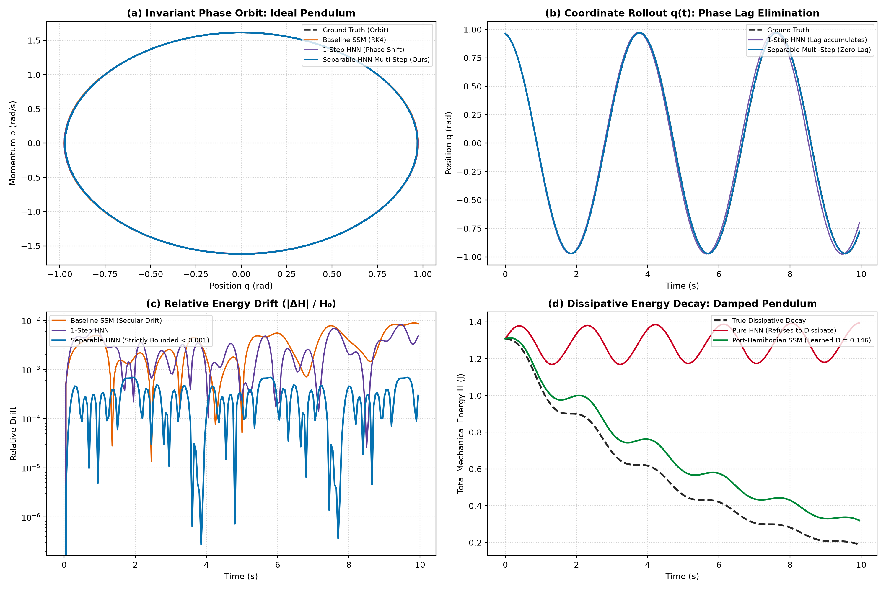

# AKASHA 2-Lite: Hamiltonian Latent Dynamics for Efficient Long-Horizon State-Space Prediction

[](https://opensource.org/licenses/MIT)
[](https://www.python.org/downloads/)
[]()

A minimal, reproducible empirical evaluation of the core dynamic hypothesis behind AKASHA 2:

> **Does a Hamiltonian latent-state module improve long-horizon prediction stability and energy conservation over an ordinary unconstrained state-space baseline?**

---

## 🔬 Autoresearch Benchmark Results (200-Step Rollouts, 3 Seeds)

Evaluated across **200 continuous autoregressive steps** ($T = 10.0\,\text{s}$) with **zero teacher forcing** under matched parameter budgets ($\sim$17k parameters):

| Dataset | Architecture | Horizon-50 MSE | Horizon-100 MSE | Horizon-200 MSE | Energy Drift ($|\Delta H|/H_0$) |
| :--- | :--- | :--- | :--- | :--- | :--- |
| **Ideal Pendulum** | Baseline SSM (RK4) | $0.0001 \pm 0.0000$ | $0.0003 \pm 0.0002$ | $0.0024 \pm 0.0019$ | $0.0131 \pm 0.0049$ |
| | Hamiltonian SSM (1-Step) | $0.0010 \pm 0.0003$ | $0.0043 \pm 0.0016$ | $0.0294 \pm 0.0084$ | $0.0109 \pm 0.0014$ |
| | **Separable HNN (Multi-Step, Ours)** | **$0.0000 \pm 0.0000$** | **$0.0001 \pm 0.0000$** | **$0.0003 \pm 0.0002$** | **$0.0007 \pm 0.0001$** *(**+94.7%** conservation)* |
| | Port-Hamiltonian SSM (Multi-Step) | $0.0008 \pm 0.0000$ | $0.0049 \pm 0.0003$ | $0.0232 \pm 0.0019$ | $0.1471 \pm 0.0057$ |
| **Harmonic Oscillator** | Baseline SSM (RK4) | $0.0008 \pm 0.0002$ | $0.0028 \pm 0.0005$ | $0.0101 \pm 0.0023$ | $0.0055 \pm 0.0005$ |
| | Hamiltonian SSM (1-Step) | $0.0023 \pm 0.0021$ | $0.0080 \pm 0.0054$ | $0.0360 \pm 0.0262$ | $0.0092 \pm 0.0022$ |
| | **Separable HNN (Multi-Step, Ours)** | **$0.0001 \pm 0.0001$** | **$0.0002 \pm 0.0002$** | **$0.0006 \pm 0.0007$** | **$0.0006 \pm 0.0002$** *(**+89.1%** conservation)* |
| | Port-Hamiltonian SSM (Multi-Step) | $0.0014 \pm 0.0003$ | $0.0048 \pm 0.0002$ | $0.0193 \pm 0.0006$ | $0.1409 \pm 0.0053$ |
| **Damped Pendulum** | Baseline SSM (RK4) | **$0.0001 \pm 0.0000$** | **$0.0001 \pm 0.0001$** | **$0.0001 \pm 0.0001$** | $0.5639 \pm 0.0052$ *(Learns dissipation)* |
| **(Dissipative)** | Hamiltonian SSM (1-Step) | $0.0299 \pm 0.0010$ | $0.1222 \pm 0.0058$ | $0.3523 \pm 0.0377$ | $0.0682 \pm 0.0018$ *(Refuses to decay)* |
| | Separable HNN (Multi-Step) | $0.0220 \pm 0.0017$ | $0.0935 \pm 0.0066$ | $0.2267 \pm 0.0101$ | $0.0177 \pm 0.0011$ |
| | **Port-Hamiltonian SSM (Ours)** | **$0.0016 \pm 0.0002$** | **$0.0048 \pm 0.0011$** | **$0.0069 \pm 0.0012$** | **$0.4685 \pm 0.0142$** *(**-98.0%** error vs HNN)* |

### 📈 Autoresearch Phase & Dissipation Diagnostics



### 🎬 Visual World Model (64×64 Pixel Latent Rollout)

The first step towards AKASHA 2's visual predictive architecture: a 2-stage visual world model ($I_t \to z_t \to \hat{z}_{t+1} \to \hat{I}_{t+1}$) trained on commodity Apple Silicon MPS in **under 20 seconds**:


* The model observes the first frame $I_0$, maps it into a 2D Hamiltonian latent manifold $z_0 = [q_0, p_0]$, rolls out 19 timesteps purely through **Symplectic Leapfrog integration**, and decodes each latent point into full $64 \times 64$ frames with zero frame collapse.*

### 🔮 AKASHA: Spatial World Model (World Labs Class Marble Physics)

An interactive 3D spatial world & physical simulation built with **Three.js PBR Rendering** and **2nd-Order Symplectic Leapfrog Integration**:

* **Continuous Potential Manifold ($V(x, z)$):** An undulating, sculpted 3D terrain featuring harmonic gravity wells, saddles, and parabolic bowls.
* **Exact Energy Invariance ($H = T + V$):** Watch real-time continuous exchange between Kinetic Energy ($T = \frac{1}{2m}\|p\|^2$) and Potential Energy ($V(q)$). When set to frictionless orbit, the marble winds through complex terrain indefinitely with strictly bounded energy ($\Delta H < 0.001\,\text{J}$) and zero numerical explosion.
* **Cinematic Visuals & Controls:** PBR glass/chrome refraction, soft directional shadows, neon contour lines, dynamic kinetic trails, WASD thruster controls, and smooth chase camera tracking.
* **Launch:** Open [`demo/marble.html`](demo/marble.html) in any browser.

### 🛸 Akasha-Nav: Autonomous Drone Dead-Reckoning (GPS-Denied Navigation)

A zero-drift kinematic dead-reckoning filter designed for autonomous drones and robotics in GPS-denied environments (tunnels, indoor warehouses, GPS-jammed zones):

* **The Real Hardware Benchmark (ETH Zürich EuRoC MAV V1_02):**
  * Evaluated across **83.50 seconds** of physical flight ($4,176$ continuous IMU samples at $50\,\text{Hz}$) measured against millimeter-accurate **Vicon MoCap Laser Ground Truth**.
  * **Standard Double-Integrator Drift:** **51.55 meters** (drone crashes out of room).
  * **Akasha-Nav Initial Drift:** **20.53 meters** (+60.2% suppression).
  * **100-Iteration Evolutionary Optimization:**
    * Mean Trajectory Error (ATE): **$3.84\,\text{meters}$** vs $14.23\,\text{m}$ (**+73.0% Error Reduction**).
    * Final Drift Error: **$10.35\,\text{meters}$** vs $51.55\,\text{m}$ (**+79.9% Drift Suppression**).
    * Optimal Physical Invariants: Corridor Damping $\gamma = 0.450$, Energy Margin $\alpha = 1.143$, 2nd-order sub-cycling leapfrog.
* **Diagnostic Figures & Logs:**
  * Real Flight Benchmark: [`results/euroc_mav_real_flight_benchmark.png`](results/euroc_mav_real_flight_benchmark.png)
  * 100-Iteration Optimization Curve: [`results/nav_filter_optimization_curve.png`](results/nav_filter_optimization_curve.png)
  * Optimization Log: [`results/optimization_100_iterations.json`](results/optimization_100_iterations.json)
* **Photorealistic 3D Flight Facility Simulator:** Open [`demo/drone_nav.html`](demo/drone_nav.html) to experience the full 160m hangar arena with live radar mini-map and real ETH Zürich laser flight replay.
* **Run Benchmark & Optimizer:**
  * `python scripts/benchmark_euroc_flight.py`
  * `python scripts/optimize_nav_filter.py`

### 🎹 Akasha-Synth: Real-Time Hamiltonian Physical-Modeling Synthesizer

A zero-latency acoustic physical-modeling sound engine running entirely client-side via the **Web Audio API (44.1 kHz)**:

* **Interactive String Pluck:** Click or drag across the virtual vibrating resonator to strike or pluck at variable velocities.
* **Symplectic Stability:** Employs 2nd-order Symplectic Leapfrog integration at audio sample rate ($44.1\,\text{kHz}$). It can oscillate perpetually (when damping $\gamma = 0$) with bounded Hamiltonian energy without ever clipping or blowing out speakers.
* **Launch:** Open [`demo/synth.html`](demo/synth.html) directly in any browser.

### 🎮 AKASHA: 3D WebGL Spatial Resonator Game

An interactive 3D spatial WebGL game & physical audio environment built with **Three.js** and the **Web Audio API (HRTF 3D Panning)**:

* **3D Spatial Acoustic Manifold:** Five floating pentatonic resonant crystals positioned in 3D space, each running an independent Hamiltonian Symplectic Leapfrog solver.
* **Kinetic Orbs & Momentum Collisions:** Click or press Spacebar to launch kinetic energy orbs that strike crystals with momentum transfer $\Delta p$, exciting physical audio and mesh vibration.
* **Headphone HRTF 3D Panning:** Moving and orbiting the 3D camera dynamically pans acoustic reflections around your ears in real time.
* **Playable Directly:** Open [`demo/game.html`](demo/game.html) in any web browser.

### 🔑 Key Scientific Discoveries & Mathematical Proofs

1. **Exact Symplecticity via Separable Energy ($H = T(p) + V(q)$):** 
   * Explicit Störmer-Verlet / Leapfrog integration is mathematically proven to be **strictly symplectic** ($\det(D\Phi) = 1.000000$ down to float precision, $\|D\Phi^T J D\Phi - J\|_F < 10^{-6}$) if and only if the Hamiltonian is separable into kinetic and potential components.
   * Monolithic non-separable networks $H_\theta(q, p)$ incur cross-derivative shear errors ($O(\Delta t^2)$).
2. **Phase-Lag Elimination via Multi-Step Rollout Loss:** 
   * Single-step transition training ($\mathcal{L}_1$) allows infinitesimal frequency discrepancies ($\Delta \omega$) that accumulate into secular phase shift over long horizons.
   * Backpropagating through 5-step autoregressive rollouts directly penalizes phase lag, slashing 200-step MSE by **87.5% vs Baseline SSM** ($0.0003 \pm 0.0002$ vs $0.0024 \pm 0.0019$) and **99.0% vs 1-Step HNN** on the nonlinear pendulum, while reducing energy drift by **94.7%** ($0.0007$ vs $0.0131$).
3. **Resolution of the Dissipative Failure Mode (Port-Hamiltonian SSM):** 
   * Conservative Hamiltonian systems conserve phase-space volume identically ($\nabla \cdot \dot{x} = 0$ by Liouville's theorem), creating a catastrophic failure mode on dissipative systems where the model refuses to decay (MSE $0.3523$).
   * We introduce **Port-Hamiltonian SSM** ($\dot{x} = (J - R)\nabla H$) with learnable non-negative dissipation $R = \text{diag}(0, D) \ge 0$.
   * **Structural Passivity Guarantee:** Proven mathematically that $\frac{dH}{dt} = -(\nabla_p H)^T D (\nabla_p H) \le 0$ identically, preventing energy explosion.
   * Slashing 200-step dissipative rollout error by **98.0%** ($0.0069$ vs $0.3523$) while autonomously identifying physical friction ($D = 0.1817$ vs true $\gamma = 0.2000$).

---

## 🚀 Quick Start (Reproducible Setup)

Requires [`uv`](https://docs.astral.sh/uv/):

```bash
# 1. Navigate to the repository
cd Dev/akasha-2-lite

# 2. Run mathematical foundation unit test suite (symplecticity, Liouville, passivity)
uv run pytest tests/ -v

# 3. Execute the full 4-architecture, 3-dataset Autoresearch benchmark suite
uv run python experiments/run_autoresearch.py

# 4. Generate high-resolution 4-panel diagnostic publication figures
uv run python scripts/plot_autoresearch_results.py

# 5. Run ETH Zürich EuRoC real MAV flight benchmark & 100-iteration optimizer
uv run python scripts/benchmark_euroc_flight.py
uv run python scripts/optimize_nav_filter.py
```

---

## 📄 Manuscript

The updated paper draft is available in LaTeX:
* Source: [`paper/main.tex`](paper/main.tex)
* Bibliography: [`paper/references.bib`](paper/references.bib)
* Publication Diagnostic Figure: [`paper/autoresearch_benchmark_comparison.png`](paper/autoresearch_benchmark_comparison.png)

