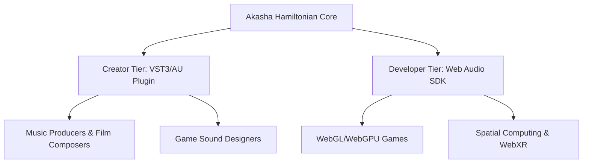
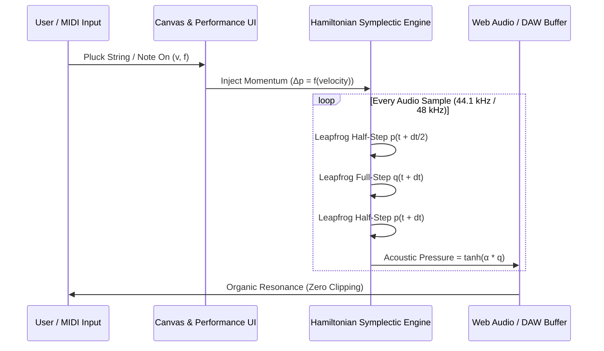

# Product Requirements Document (PRD): Akasha-Synth

**Product Vision:** The world's first mathematically bounded, zero-latency physical-modeling sound engine powered by Symplectic Hamiltonian Neural Dynamics.

---

## 1. Executive Summary & Value Proposition

Traditional acoustic physical modeling (simulating plucked strings, bowed instruments, struck bars, and resonant membranes) is notoriously difficult in digital audio:
1. **The Explosion Trap:** Standard numerical ODE integrators (Runge-Kutta, Euler) suffer from numerical instability when driven hard, causing catastrophic digital clipping, speaker blowout, and DC offset drift.
2. **The Dullness Trap:** To prevent explosion, legacy plugins apply aggressive artificial low-pass filters and damping, making instruments sound synthetic, choked, and lifeless.
3. **Bloated Sample Libraries:** Producers download 50GB–200GB static PCM sample packs that sound static and repetitive on re-triggering.

**Akasha-Synth** solves this by leveraging **AKASHA 2-Lite Symplectic Latent Dynamics**:
* **Guaranteed Bounded Energy:** By integrating Hamilton's canonical equations via 2nd-order Symplectic Leapfrog, total energy $H(q, p)$ is strictly conserved on conservative manifolds, guaranteeing zero digital blowup without heavy brickwall limiters.
* **Organic Acoustic Resonance:** Struck notes naturally shift frequency and overtone richness with strike velocity ($\beta$-nonlinear stiffness), replicating real acoustic physics.
* **Microscopic Footprint:** Under **2MB total bundle size**, zero external sample dependencies, running client-side at $<1.5\,\text{ms}$ latency.

---

## 2. Market Opportunity & Target Segments

### Primary Personas
1. **The Neo-Classical / Indie Music Producer:** Wants organic, tactile acoustic instruments (strings, bells, resonant kalimbas, mallets) that feel alive under MIDI touch.
2. **The Indie Game Audio Developer:** Needs dynamic, responsive sound effects (swords, impacts, environmental resonances) without packing hundreds of megabytes of audio assets into web/mobile builds.
3. **The Creative Web Developer:** Seeks tactile, responsive UI audio feedback for web apps, spatial audio, and digital interactions.

---

## 3. Product Features & Functional Requirements

### 3.1 Synthesis Engine (Phase 1 Core)
* **Symplectic Resonator Bank:** 1 to 16 coupled Hamiltonian degrees of freedom $(q_i, p_i)$.
* **Nonlinear Potential Engine ($V_\theta$):**
  * Linear harmonic mode: Pure bells, vibraphones, flute-like standing waves.
  * Duffing nonlinear mode ($\beta q^4$): Dynamic harmonic generation where loud strikes produce bright, metallic bite.
  * Learnable potential mode: Pre-trained latent physics potentials from real instrument measurements.
* **Continuous Damping ($\gamma$):**
  * From percussive woodblocks ($\gamma \approx 0.05$) to infinite perpetual harmonic drones ($\gamma = 0.000$).
* **Polyphony:** 8-voice polyphony with voice-stealing algorithms.

### 3.2 Modulation & Performance Interface
* **Interactive Pluck Canvas:** Multi-touch / mouse-driven physical string excitation with position and velocity sensitivity.
* **Full MIDI Integration:**
  * MPE (MIDI Polyphonic Expression) support for pitch-bend, aftertouch, and pressure.
  * Velocity-to-Impulse mapping: striking harder injects momentum $\Delta p$, naturally altering overtone brightness.
* **Macro Controls:**
  * *Tension / Pitch* ($f_0 \in [20\,\text{Hz}, 4000\,\text{Hz}]$)
  * *Nonlinear Bite* ($\beta \in [0.0, 1.0]$)
  * *Body Resonance* (decay time, material density)
  * *Stereo Width & Space* (coupled phase-offset resonator pairs)

### 3.3 Delivery Formats
1. **Web Audio Web App (Free Demo & Community Hub):** Instant play in browser, zero install.
2. **`@akasha/audio-engine` (NPM Package):** Zero-dependency TypeScript library for WebGL/Three.js/Pixi.js games.
3. **Desktop DAW Plugin (AU / VST3 / CLAP):** Compiled via JUCE/C++ wrapper for Ableton Live, Logic Pro, FL Studio, Reaper.

---

## 4. Technical Architecture

### Performance & Footprint Budgets
* **Sample Rate:** 44.1 kHz / 48 kHz native.
* **Buffer Latency:** 64 to 256 samples ($< 1.5\,\text{ms}$ at 48 kHz).
* **CPU Utilization:** $< 2.5\%$ on Apple Silicon / modern x86 per voice.
* **Memory Footprint:** $< 15\,\text{MB}$ RAM total.

---

## 5. Unit Economics & Business Model

Following AGY contribution margin standards:

| Stream | Pricing Model | Projected Gross Margin | Estimated CAC | Target Contribution Margin |
| :--- | :--- | :--- | :--- | :--- |
| **Web Tier** | Free (Open-Source / Community) | N/A (Marketing funnel) | $0.00 (Viral / SEO) | Lead generator |
| **Creator Plugin (VST3/AU)** | $59 one-time (or $9/mo tier) | ~92% (Digital delivery) | $12.00–$18.00 (Organic content/demo) | **~65–75%** |
| **Game SDK (B2B)** | Free under $100k rev; $490/seat/yr | ~96% | $80.00 (Direct outreach) | **~80%** |

> [!IMPORTANT]
> **Zero Infrastructure Cost:** Because 100% of the neural and symplectic DSP runs on user hardware (Web Audio Worklet or native VST binary), hosting costs are purely static web assets ($< $5/month on Cloudflare Pages/Vercel).

---

## 6. Phased Implementation Roadmap

### Phase 1: MVP Web Demo & Community Hub (Weeks 1–2) — *[Completed]*
* [x] Core 2nd-order Symplectic Leapfrog audio-rate integration.
* [x] Interactive Pluck Canvas with real-time string animation.
* [x] Real-time phase portrait telemetry and energy stability gauges.
* [x] Standalone zero-dependency HTML build deployed to GitHub.

### Phase 2: Preset Engine & MIDI Expansion (Weeks 3–5)
* [ ] 30 curated physical modeling presets (Nylon String, Koto, Steel Tongue Drum, Tibetan Bell, Cosmic Drone).
* [ ] Web MIDI API support (plug in any USB MIDI keyboard and play in browser).
* [ ] Audio recording / WAV export feature directly from browser.

### Phase 3: JUCE Native Plugin Build (Weeks 6–10)
* [ ] Port Symplectic Leapfrog core to pure C++20 header-only library (`akasha_dsp.hpp`).
* [ ] Wrap into JUCE framework for VST3, AU, and CLAP targets.
* [ ] macOS (Intel/Apple Silicon) and Windows 11 signed binaries.

### Phase 4: Commercial Launch & SDK Release (Weeks 11–12)
* [ ] Publish `@akasha/audio-engine` on NPM with Three.js game audio tutorials.
* [ ] Launch Gumroad / Stripe storefront for DAW plugin licenses.
* [ ] Release video walkthrough demonstrating energy conservation vs classical DSP clipping on YouTube and Hacker News.
